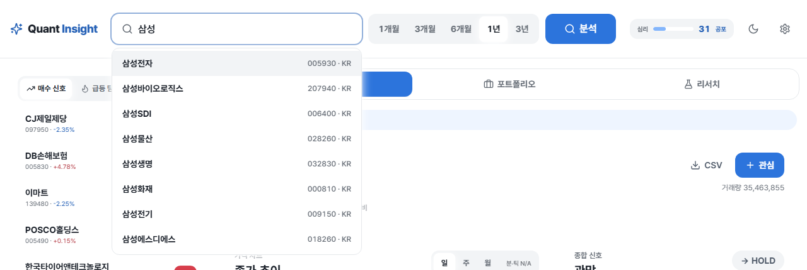

# Quant Insight

주식 가격 데이터를 조회해 기술적 지표, 단기 가격 예측, 리스크 분석, 백테스트, 매수/매도/관망 신호를 제공하는 웹 애플리케이션입니다. 실제 주문 실행 기능은 없으며, 모든 신호는 알고리즘 기반 참고 정보입니다.

**[▶ 데모 열기](https://wodyd0103-byte.github.io/stock-signal-dashboard/)** — 백엔드 없이 도는 정적 배포입니다. 화면의 숫자는 실제 백엔드가 돌려준 응답을 그대로 받아둔 것이라 진짜지만, 값은 그 시점에 고정돼 있고 개별 종목 분석은 삼성전자(005930)만 포함돼 있습니다.


<details>
<summary>다크 모드</summary>


</details>

## 기술 스택

| 영역 | 사용 기술 |
| --- | --- |
| 프론트엔드 | Next.js 16 (App Router), React 18, TypeScript, Tailwind CSS, Recharts, lucide-react |
| 백엔드 | FastAPI, SQLAlchemy, Alembic, SQLite |
| 분석 | pandas, numpy, scikit-learn (RandomForestClassifier) |
| 데이터 | pykrx, FinanceDataReader, yfinance |

## 실행

### 원클릭 (Windows)

`start.bat`을 더블클릭하면 가상환경 생성, 의존성 설치, 백엔드/프론트엔드 기동, 헬스체크, 브라우저 열기까지 한 번에 처리합니다. 종료는 `stop.bat`입니다.

```powershell
./start.ps1
```

### 수동 실행

백엔드:

```powershell
cd backend
python -m venv .venv
.venv\Scripts\python.exe -m pip install -r requirements.txt
.venv\Scripts\python.exe -m uvicorn app.main:app --reload --port 8000
```

프론트엔드:

```bash
cd frontend
npm install
npm run dev
```

- 앱: `http://localhost:3000`
- API 문서: `http://localhost:8000/docs`

## 관심종목 일일 리포트 (CLI)

서버와 프론트엔드를 띄우지 않고 관심종목·보유 종목만 분석해 한 장으로 뽑는 도구입니다.
`digest.bat`을 더블클릭하면 분석 후 HTML 리포트가 브라우저로 열립니다.

```powershell
cd backend
.venv\Scripts\python.exe -m tools.digest --md --html --open
```

| 옵션 | 설명 |
| --- | --- |
| `--source` | `watchlist`, `holdings` 중 콤마로. 기본은 둘 다 |
| `--period` | `1mo` \| `3mo` \| `6mo` \| `1y` \| `3y`. 기본 `1y` |
| `--md`, `--html` | 마크다운/HTML 파일로 저장 |
| `--open` | 저장한 HTML을 브라우저로 열기 |
| `--out` | 출력 디렉터리. 기본 `backend/data/digest/` |
| `--no-save` | 스냅샷을 남기지 않음 (다음 실행의 비교 대상이 되지 않습니다) |
| `--notify` | 신호 변화가 있을 때만 알림. `auto`(토스트, 실패 시 콘솔) \| `toast` \| `email` \| `all` \| `console` \| `off`. **기본은 `off`** |
| `--renotify` | 같은 변화라도 다시 알림 (중복 차단 해제) |
| `--score-move` | 등급이 그대로여도 매수점수가 이만큼 움직이면 보고 (기본 15) |
| `--no-evaluate` | 회고 채점을 건너뜀 (기본은 horizon 지난 추천을 채점) |

변화 이력은 `signal_changes` 테이블에도 쌓입니다. 스냅샷이 "직전 대비 무엇이 바뀌었나"라면
이쪽은 "이 종목이 최근 몇 번 뒤집혔나"에 답합니다. 같은 날 여러 번 돌려도 같은 전환이 중복
적재되지 않습니다.

등급이 바뀐 종목에는 최근 30일 전환 횟수가 함께 붙습니다 — `BUY → HOLD · 30일 3회`처럼.
자주 뒤집히는 종목일수록 오늘의 변화를 덜 믿어야 한다는 판단 재료입니다. 2회 미만이면
표시하지 않습니다(1회는 오늘의 전환일 뿐입니다). 이 횟수는 **등급 전환만** 셉니다 —
점수 이동까지 세면 그 숫자가 무슨 뜻인지 흐려집니다.

알림은 **변화가 있을 때만, 같은 변화로는 한 번만** 나갑니다. 변화 없는 날에도 알림이 오면 곧
무시하게 되고, 하루에 두 번 돌렸다고 같은 알림이 두 번 오면 마찬가지입니다. 보낸 내용의 지문을
출력 디렉터리에 남겨 두고 비교합니다(`--renotify` 로 해제). 알림 자체는 **기본으로 꺼져 있어서**
`--notify` 를 줄 때만 동작합니다.

- `toast` — 외부 패키지 없이 PowerShell로 Windows 토스트. 그 PC 앞에 있어야 보입니다.
- `email` — `backend/.env` 에 SMTP 값 네 개(`DIGEST_SMTP_HOST`, `DIGEST_SMTP_USER`,
  `DIGEST_SMTP_PASSWORD`, `DIGEST_MAIL_TO`)가 모두 채워졌을 때만 보냅니다. 하나라도 비면
  조용히 건너뛰고 이유를 알려줍니다. Gmail은 계정 비밀번호가 아니라 앱 비밀번호가 필요합니다.
- `all` — 둘 다. 한쪽이 실패해도 다른 쪽은 나갑니다.

실행할 때마다 `backend/data/digest/<날짜>.json` 스냅샷을 남기고, 다음 실행에서 **직전 스냅샷과
비교해 달라진 것만** 상단에 따로 보여줍니다. 비교는 세 가지를 봅니다.

| 종류 | 언제 | 표시 |
| --- | --- | --- |
| 신호 등급 | `HOLD` → `BUY` 처럼 등급이 바뀌면 | `▲ BUY → HOLD` |
| 매수점수 | 등급은 그대로인데 점수가 15점 이상 움직이면 | `· 매수점수 1 → 18` |
| 리스크 등급 | `높음` → `보통` 처럼 등급이 바뀌면 | `· 리스크 높음 → 보통` |

등급만 보면 매수점수가 1에서 18로 뛴 날도 "어제와 같다"가 됩니다. 그런 날은 같은 날이 아닙니다.
점수 기준은 `--score-move` 또는 `DIGEST_SCORE_MOVE_FLOOR` 로 바꿉니다. 한 종목에서 등급이
바뀌었으면 그 종목의 점수 이동은 따로 적지 않습니다 — 같은 사실을 두 줄로 말하지 않습니다. "어제"를 고정으로 찾지 않고 마지막으로 돌린
날과 비교하므로 주말이나 며칠을 걸러도 변화가 이어집니다.

digest는 실행할 때마다 **회고 채점**도 같이 합니다. 채점이 도는 곳은 원래 스케줄러와 화면의
"지금 채점" 버튼뿐이라, 둘 다 안 쓰면 추천이 `open`으로 남아 영영 채점되지 않습니다. digest는
어차피 매일 도니 여기서 같이 처리합니다(`--no-evaluate`로 끕니다).

채점은 **추천일 + horizon 시점의 종가**로 합니다. 현재가로 재면 늦게 채점할수록 숫자가 부풀어
오릅니다 — horizon 5일짜리를 71일 뒤에 채점하면 71일 수익률이 5일 성과로 남고, 적중률과
평균수익이 그 위에 쌓입니다. 그 날이 휴장이면 다음 거래일 종가를 씁니다.

digest는 **새 추천을 만들지 않습니다.** 분석 엔드포인트가 하는 추천 기록은 CLI 경로에서
실행되지 않으므로, 리포트를 여러 번 뽑아도 없던 추천이 생기지 않습니다.

출력 디렉터리에는 보유 수량과 평단가가 들어가기 때문에 `.gitignore`에 포함돼 있습니다.

아침마다 자동으로 돌리려면 작업 스케줄러에 `digest-scheduled.bat`을 겁니다 —
등록 명령과 확인·해제 방법은 [docs/SCHEDULING.md](docs/SCHEDULING.md)에 있습니다.

동시 분석 수와 종목당 제한 시간은 환경변수로 조정합니다.

```env
DIGEST_MAX_WORKERS=4
DIGEST_ITEM_TIMEOUT_SECONDS=40
```

## 화면 구성

단일 페이지 애플리케이션이며, 상단 탭으로 영역을 전환합니다.

- **분석** — 가격 차트(종가/MA20/MA60), 종합 신호와 판정 근거(최근 30일 전환 횟수 포함), 기술적 지표, 리스크, 예측 가격, 목표가, 공시, 뉴스 감성, 수급, 백테스트 결과, 종목 비교
- **포트폴리오** — 보유 종목 등록, 포트폴리오 분석, 리밸런싱 및 비중 최적화 제안
- **리서치** — 과거 신호의 사후 검증(retrospective), 신호 전환 이력, 팩터별 IC(정보계수) 분석

좌측 레일은 매수 신호 상위 종목과 급등 탐색 결과를 보여주고, 관심 종목을 관리합니다. 상단에는 종목 검색, 기간 선택(1개월~3년), 시장 심리 지표, 다크 모드 토글, 설정이 있습니다.

종목 검색은 한글 종목명과 티커를 모두 받습니다. 대표 종목 목록을 처음 검색할 때 한 번 받아 클라이언트에서 거르므로 타이핑마다 요청이 나가지 않습니다. 화살표와 Enter로 고를 수 있고, 목록에 없는 종목도 그대로 입력해 조회할 수 있습니다.



## API

기본 prefix는 `/api`입니다.

| 그룹 | 엔드포인트 |
| --- | --- |
| 종목 | `GET /stocks/{ticker}/price`, `/indicators`, `/prediction`, `/signal`, `/analysis`, `/backtest` |
| 시장 | `GET /market/sentiment`, `/representative-stocks`, `/buy-signals`, `/compare` |
| 급등 | `GET /surge/scan`, `GET /surge/{ticker}` |
| 관심종목 | `GET /watchlist`, `POST /watchlist`, `DELETE /watchlist/{ticker}` |
| 포트폴리오 | `GET /portfolio/holdings`, `POST /portfolio/holdings`, `DELETE /portfolio/holdings/{ticker}`, `GET /portfolio/analysis`, `/rebalance`, `/optimize` |
| 리서치 | `GET /ic/factors`, `GET /retrospective/summary`, `POST /retrospective/evaluate`, `GET /retrospective/signal-changes` (`?ticker=` 로 한 종목만) |
| 내보내기 | `GET /export/buy-signals.csv`, `/export/watchlist.csv`, `/export/stock/{ticker}.csv` |

## 데이터 제공자와 fallback

`DATA_PROVIDER=auto`가 기본값입니다. 6자리 숫자 또는 `.KS`, `.KQ` 티커는 한국 주식으로 판단해 `pykrx`를 우선 사용하고 실패 시 `FinanceDataReader`를 시도합니다. 영문 티커는 해외 주식으로 판단해 `yfinance`를 사용합니다.

`ALLOW_SAMPLE_FALLBACK=false`가 기본값이므로 실데이터 조회 실패 시 샘플 데이터로 조용히 넘어가지 않고 명확한 오류를 반환합니다. 개발 중 샘플 fallback을 허용하려면 `backend/.env`에 `ALLOW_SAMPLE_FALLBACK=true`를 설정하세요. 이 경우 API와 화면에 `source="sample"`, `is_sample=true`가 표시됩니다.

## 매수 신호 모니터

`/api/market/representative-stocks`는 `source=auto`일 때 KRX/pykrx와 주요 미국 지수 구성 종목 수집을 우선 시도하고, 실패하면 `backend/app/core/stock_universe.py`의 fallback 목록을 사용합니다.

`/api/market/buy-signals`는 대표 종목을 배치 단위로 제한된 병렬 worker에서 분석합니다. 일부 종목이 실패해도 전체 응답은 유지되며 실패 종목은 `failed_items`에 담깁니다.

```text
GET http://127.0.0.1:8000/api/market/representative-stocks?market=all&kr_limit=100&us_limit=100&source=auto
GET http://127.0.0.1:8000/api/market/buy-signals?market=all&min_signal=WEAK_BUY&kr_limit=100&us_limit=100&limit=20&sort_by=signal
```

주요 환경변수:

```env
BUY_SIGNAL_KR_LIMIT=100
BUY_SIGNAL_US_LIMIT=100
BUY_SIGNAL_BATCH_SIZE=10
BUY_SIGNAL_MAX_WORKERS=5
BUY_SIGNAL_ITEM_TIMEOUT_SECONDS=25
BUY_SIGNAL_REFRESH_SECONDS=60
DATA_PROVIDER_TIMEOUT_SECONDS=12
DATA_CACHE_TTL_SECONDS=60
UNIVERSE_CACHE_TTL_SECONDS=3600
```

외부 데이터 제공자는 네트워크 상태, 장 운영 시간, rate limit에 따라 응답이 지연되거나 실패할 수 있습니다. 타임아웃을 넘긴 종목은 `failed_items`로 분리되며 전체 응답은 유지됩니다. worker 수와 TTL을 지나치게 공격적으로 낮추면 provider 제한에 걸릴 수 있습니다.

## 신호 엔진

초기 신호 엔진은 절대 점수 기준만 사용했기 때문에 시장 전체가 애매한 날에는 많은 종목이 HOLD로 분류됐습니다. 현재 엔진은 단일 종목 분석에서 최종 보정 점수를 사용하고, 다종목 모니터에서는 대표 종목 universe 안에서의 상대순위 percentile을 함께 사용합니다.

- `raw_buy_score`, `raw_sell_score`: 기술적 지표 기반 원점수
- `final_buy_score`, `final_sell_score`: 시장국면, ML 상승확률, 유동성, 상대강도, 국내 수급 구조를 반영한 최종 점수
- `buy_score_percentile`, `sell_score_percentile`: universe 안에서의 상대 위치
- `market_regime`: BULL_TREND, BEAR_TREND, SIDEWAYS, HIGH_VOLATILITY, RECOVERY, BEAR_CRASH
- `ml_up_probability`: 5거래일 후 +2% 이상 상승 확률(RandomForestClassifier). 데이터가 부족하면 null을 반환하고 앱은 점수 기반으로 계속 동작합니다.

하락장 또는 고변동성 장에서는 리스크 조건을 더 엄격하게 적용하며, HOLD 종목에는 리스크, 유동성, 시장국면, 상대순위 부족 등 판단 이유를 함께 제공합니다.

백테스트는 다음 전략을 비교합니다.

- `absolute_score_strategy`: 절대 점수 기반
- `percentile_rank_strategy`: 상대순위 기반
- `ml_probability_strategy`: ML 상승확률 기반
- `regime_adjusted_strategy`: 시장국면 보정

## 테스트

백엔드:

```powershell
cd backend
.venv\Scripts\python.exe -m pytest
```

프론트엔드 (GitHub Actions에서 도는 것과 같은 순서):

```powershell
cd frontend
npm run format:check   # Prettier. 고칠 때는 npm run format
npm run lint           # ESLint
npm test               # vitest. 훅·컴포넌트 단위. 브라우저 없이 2초
npm run build          # 타입 체크 포함
npx playwright test    # 레이아웃·CLS·요청 수·접근성. 백엔드 없이 돈다
```

`cd frontend && npm install`이 `.githooks`를 커밋 훅으로 등록하므로, 포맷이 어긋난 커밋은 CI까지 가기 전에 로컬에서 막힙니다. 수동 등록은 `npm run hooks:install`, 우회는 `git commit --no-verify`입니다.

## 측정 (Lighthouse)

Lighthouse 12.8.2. 두 벌의 수치가 있고, 재는 조건이 달라 서로 비교하면 안 됩니다.

### 배포본 (2026-08-26, 모바일 7회 · 데스크톱 3회 중앙값)

| | 모바일 | 데스크톱 |
| --- | --- | --- |
| Performance | 59 <sub>(49–70)</sub> | 83 <sub>(83–84)</sub> |
| Accessibility | **100** | **100** |
| Best Practices | **100** | **100** |
| SEO | **100** | **100** |

**모바일 성능 점수는 실행마다 20점 넘게 흔들립니다.** 7회를 돌려 49~70이 나왔습니다. 3회
중앙값으로는 그 폭을 볼 수 없어서 표본을 늘렸고, 괄호 안이 실측 범위입니다. 같은 커밋을
두 번 재고 "좋아졌다/나빠졌다"를 말하면 대부분 노이즈를 읽는 것입니다.

```bash
npx lighthouse@12 https://wodyd0103-byte.github.io/stock-signal-dashboard/ --view
npx lighthouse@12 https://wodyd0103-byte.github.io/stock-signal-dashboard/ --preset=desktop --view
```

### 로컬 before/after (2026-08-27)

렌더 블로킹 폰트 스타일시트 제거와 레이아웃 흔들림 수정의 효과를 보려고 **같은 기계에서
같은 방법으로 두 번** 쟀습니다. `NEXT_PUBLIC_DEMO=1 npm run build && npx next start`로 띄운
로컬 서버가 대상이라, 위의 배포본 숫자와는 조건이 다릅니다(네트워크 지연도 CDN도 없음).
비교해도 되는 것은 **아래 두 열 사이**뿐입니다. 모바일 7회 · 데스크톱 3회 중앙값.

| | 이전 (`main`) | 이후 | |
| --- | --- | --- | --- |
| 모바일 Performance | 66 <sub>(65–66)</sub> | 67 <sub>(65–68)</sub> | 노이즈 안 |
| 모바일 FCP | 3.66s <sub>(2.74–3.77)</sub> | 2.87s <sub>(2.87–2.88)</sub> | ↓ |
| 모바일 CLS | 0.113 | **0.067** | 기준(0.1) 통과 |
| 데스크톱 Performance | 84 <sub>(83–84)</sub> | **96** | ↑ 12 |
| 데스크톱 CLS | 0.271 | **0.062** | 기준 통과 |
| Accessibility / Best Practices / SEO | 100 | 100 | 그대로 |

로컬에서 잰 데스크톱 CLS 0.271은 배포본에서 나온 값과 같습니다. CLS는 네트워크 조건을
거의 타지 않아서, 이 항목만은 로컬 수치를 그대로 믿어도 됩니다.

**성능 점수가 아니라 CLS가 움직였습니다.** 모바일 점수는 두 열 모두 노이즈 범위 안이고,
데스크톱 점수 12점은 대부분 CLS 개선이 끌어올린 것입니다. 폰트 스타일시트를 걷어낸 효과는
FCP(3.66s → 2.87s)에는 보이지만 점수로는 크게 드러나지 않습니다 — 2026-08-22에
`preconnect`를 넣었을 때와 같은 양상입니다.

접근성 100은 [`frontend/tests/a11y.spec.ts`](frontend/tests/a11y.spec.ts)가 매 PR마다
같은 기준(WCAG 2.1 AA)을 4화면 × 2테마로 강제한 결과입니다. Lighthouse는 그것을 외부에서
한 번 더 확인해 준 것이지, 여기서 처음 맞춘 값이 아닙니다.

CLS는 이제 Lighthouse를 손으로 돌리지 않아도 지켜집니다.
[`frontend/tests/layout-shift.spec.ts`](frontend/tests/layout-shift.spec.ts)가 매 PR마다
데스크톱·모바일 두 폭에서 0.1 미만을 강제합니다.

**남은 것**: 폰트 **파일**은 여전히 외부 CDN(jsDelivr)에서 옵니다. 렌더를 막던 스타일시트만
번들로 내렸습니다. 파일까지 자체 호스팅하려면 dynamic subset 92조각(약 3.2MB)을 저장소에
넣어야 하고, `next/font/local`은 `unicode-range`를 표현하지 못해 통짜 2.0MB 파일밖에 쓸 수
없습니다. 자세한 판단은 [설계 노트](docs/ARCHITECTURE.md#9-알려진-구조적-빚)에 있습니다.

## 배포

<https://wodyd0103-byte.github.io/stock-signal-dashboard/>

프론트엔드는 GitHub Pages에 **데모 모드**로 올라갑니다(`.github/workflows/pages.yml`, `main` 머지마다 자동). 백엔드(FastAPI)는 외부 시세 조회와 SQLite 쓰기가 필요해 정적 호스팅에 올릴 수 없으므로, `frontend/demo-data/`에 받아둔 실제 응답을 백엔드와 같은 경로 모양의 정적 파일로 펼쳐 앱이 그것을 읽습니다.

값이 고정이라는 사실은 상단 배너와 데이터 출처 줄이 알리고, 데모에 없는 종목을 고르면 그렇다고 표시합니다. 개별 종목 분석은 삼성전자(005930) 응답만 포함돼 있습니다. 자세한 내용은 [frontend/README.md](frontend/README.md#배포-github-pages-와-데모-모드).

## 회고와 로드맵

14일 동안 무엇을 바꿨고 무엇을 틀렸는지, 그리고 무엇을 남겨 두는지는
[docs/RETROSPECTIVE.md](docs/RETROSPECTIVE.md)에 있습니다.

남은 것 중 제일 먼저인 것 하나만 옮겨 적으면 — **백엔드에 인증이 전혀 없습니다.**
로컬 전용이라 지금은 문제가 아니지만, 공개 IP에 띄우는 순간 누구나 남의 보유 종목을
추가·삭제할 수 있습니다.

실시간 주문 실행은 로드맵이 아니라 **범위 밖**입니다. 이 앱은 분석 전용이고, 매매는
외부 증권사 앱에서 하며 결과는 CSV로 내보냅니다.

## 투자 유의사항

본 서비스의 분석, 예측, 매수/매도 신호는 과거 데이터와 알고리즘을 기반으로 한 참고 정보입니다. 실제 투자 결과를 보장하지 않으며, 모든 투자 판단과 책임은 사용자 본인에게 있습니다. 이 애플리케이션은 실제 주문 실행 기능을 포함하지 않습니다.

## 라이선스

[MIT](LICENSE). 투자 판단과 그 결과에 대한 책임은 사용자 본인에게 있습니다 —
위 [투자 유의사항](#투자-유의사항)을 참고하세요.

## 저장소 구조

```text
backend/    FastAPI 앱 (routers, services, models, schemas, migrations, tests)
frontend/   Next.js 앱 (app, components, lib)
docs/       설계 노트와 스크린샷
start.ps1   원클릭 실행 스크립트
digest.bat  관심종목 일일 리포트 (backend/tools/digest)
digest-scheduled.bat  작업 스케줄러용 (브라우저를 열지 않음)
```

## 설계 노트

왜 이렇게 만들어졌는지는 [docs/ARCHITECTURE.md](docs/ARCHITECTURE.md)에 있습니다 —
배포가 앱과 갈라진 이유, 데이터 조회가 실패를 감추지 않는 방식, 테스트 세 층의 분업,
새 테스트를 회귀 주입으로 검증하는 방법, 접근성 게이트와 자동 검사의 사각지대,
그리고 **일부러 하지 않은 것과 알려진 빚**.

14일간의 회고는 [docs/RETROSPECTIVE.md](docs/RETROSPECTIVE.md)에 있습니다.
