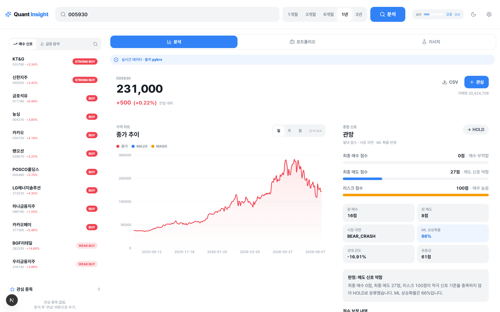
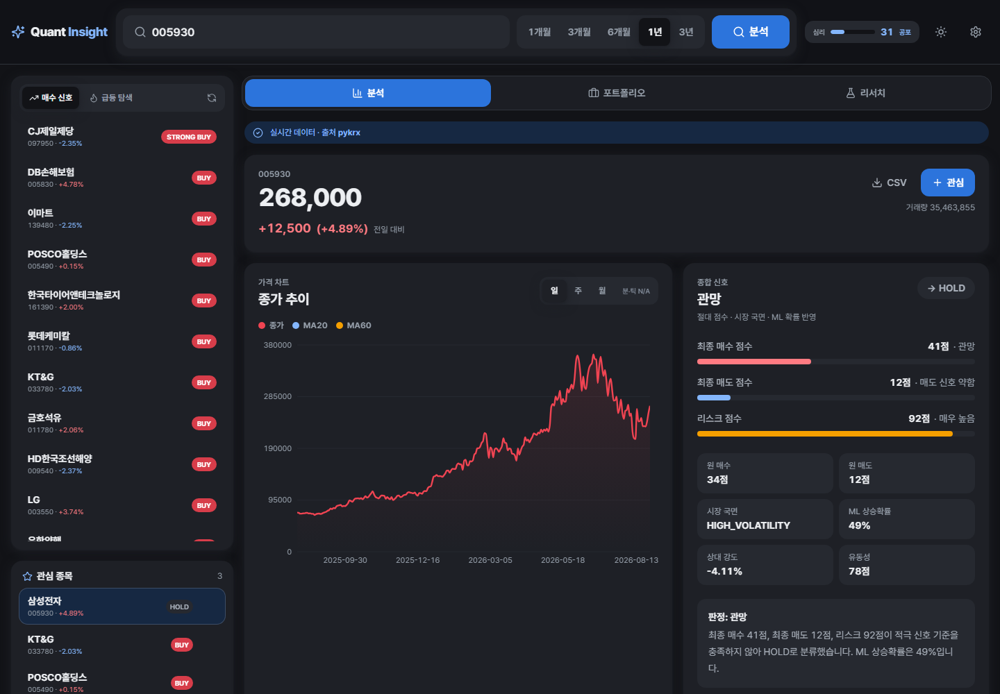

# Quant Insight

주식 가격 데이터를 조회해 기술적 지표, 단기 가격 예측, 리스크 분석, 백테스트, 매수/매도/관망 신호를 제공하는 웹 애플리케이션입니다. 실제 주문 실행 기능은 없으며, 모든 신호는 알고리즘 기반 참고 정보입니다.



<details>
<summary>다크 모드</summary>



</details>

## 기술 스택

| 영역 | 사용 기술 |
| --- | --- |
| 프론트엔드 | Next.js 16 (App Router), React 18, TypeScript, Tailwind CSS, Recharts, lucide-react |
| 백엔드 | FastAPI, SQLAlchemy, Alembic, SQLite |
| 분석 | pandas, numpy, scikit-learn (RandomForestClassifier) |
| 데이터 | pykrx, FinanceDataReader, yfinance |

## 실행

### 원클릭 (Windows)

`start.bat`을 더블클릭하면 가상환경 생성, 의존성 설치, 백엔드/프론트엔드 기동, 헬스체크, 브라우저 열기까지 한 번에 처리합니다. 종료는 `stop.bat`입니다.

```powershell
./start.ps1
```

### 수동 실행

백엔드:

```powershell
cd backend
python -m venv .venv
.venv\Scripts\python.exe -m pip install -r requirements.txt
.venv\Scripts\python.exe -m uvicorn app.main:app --reload --port 8000
```

프론트엔드:

```bash
cd frontend
npm install
npm run dev
```

- 앱: `http://localhost:3000`
- API 문서: `http://localhost:8000/docs`

## 화면 구성

단일 페이지 애플리케이션이며, 상단 탭으로 영역을 전환합니다.

- **분석** — 가격 차트(종가/MA20/MA60), 종합 신호와 판정 근거, 기술적 지표, 리스크, 예측 가격, 목표가, 공시, 뉴스 감성, 수급, 백테스트 결과, 종목 비교
- **포트폴리오** — 보유 종목 등록, 포트폴리오 분석, 리밸런싱 및 비중 최적화 제안
- **리서치** — 과거 신호의 사후 검증(retrospective), 팩터별 IC(정보계수) 분석

좌측 레일은 매수 신호 상위 종목과 급등 탐색 결과를 보여주고, 관심 종목을 관리합니다. 상단에는 종목 검색, 기간 선택(1개월~3년), 시장 심리 지표, 다크 모드 토글, 설정이 있습니다.

## API

기본 prefix는 `/api`입니다.

| 그룹 | 엔드포인트 |
| --- | --- |
| 종목 | `GET /stocks/{ticker}/price`, `/indicators`, `/prediction`, `/signal`, `/analysis`, `/backtest` |
| 시장 | `GET /market/sentiment`, `/representative-stocks`, `/buy-signals`, `/compare` |
| 급등 | `GET /surge/scan`, `GET /surge/{ticker}` |
| 관심종목 | `GET /watchlist`, `POST /watchlist`, `DELETE /watchlist/{ticker}` |
| 포트폴리오 | `GET /portfolio/holdings`, `POST /portfolio/holdings`, `DELETE /portfolio/holdings/{ticker}`, `GET /portfolio/analysis`, `/rebalance`, `/optimize` |
| 리서치 | `GET /ic/factors`, `GET /retrospective/summary`, `POST /retrospective/evaluate` |
| 내보내기 | `GET /export/buy-signals.csv`, `/export/watchlist.csv`, `/export/stock/{ticker}.csv` |

## 데이터 제공자와 fallback

`DATA_PROVIDER=auto`가 기본값입니다. 6자리 숫자 또는 `.KS`, `.KQ` 티커는 한국 주식으로 판단해 `pykrx`를 우선 사용하고 실패 시 `FinanceDataReader`를 시도합니다. 영문 티커는 해외 주식으로 판단해 `yfinance`를 사용합니다.

`ALLOW_SAMPLE_FALLBACK=false`가 기본값이므로 실데이터 조회 실패 시 샘플 데이터로 조용히 넘어가지 않고 명확한 오류를 반환합니다. 개발 중 샘플 fallback을 허용하려면 `backend/.env`에 `ALLOW_SAMPLE_FALLBACK=true`를 설정하세요. 이 경우 API와 화면에 `source="sample"`, `is_sample=true`가 표시됩니다.

## 매수 신호 모니터

`/api/market/representative-stocks`는 `source=auto`일 때 KRX/pykrx와 주요 미국 지수 구성 종목 수집을 우선 시도하고, 실패하면 `backend/app/core/stock_universe.py`의 fallback 목록을 사용합니다.

`/api/market/buy-signals`는 대표 종목을 배치 단위로 제한된 병렬 worker에서 분석합니다. 일부 종목이 실패해도 전체 응답은 유지되며 실패 종목은 `failed_items`에 담깁니다.

```text
GET http://127.0.0.1:8000/api/market/representative-stocks?market=all&kr_limit=100&us_limit=100&source=auto
GET http://127.0.0.1:8000/api/market/buy-signals?market=all&min_signal=WEAK_BUY&kr_limit=100&us_limit=100&limit=20&sort_by=signal
```

주요 환경변수:

```env
BUY_SIGNAL_KR_LIMIT=100
BUY_SIGNAL_US_LIMIT=100
BUY_SIGNAL_BATCH_SIZE=10
BUY_SIGNAL_MAX_WORKERS=5
BUY_SIGNAL_ITEM_TIMEOUT_SECONDS=25
BUY_SIGNAL_REFRESH_SECONDS=60
DATA_PROVIDER_TIMEOUT_SECONDS=12
DATA_CACHE_TTL_SECONDS=60
UNIVERSE_CACHE_TTL_SECONDS=3600
```

외부 데이터 제공자는 네트워크 상태, 장 운영 시간, rate limit에 따라 응답이 지연되거나 실패할 수 있습니다. 타임아웃을 넘긴 종목은 `failed_items`로 분리되며 전체 응답은 유지됩니다. worker 수와 TTL을 지나치게 공격적으로 낮추면 provider 제한에 걸릴 수 있습니다.

## 신호 엔진

초기 신호 엔진은 절대 점수 기준만 사용했기 때문에 시장 전체가 애매한 날에는 많은 종목이 HOLD로 분류됐습니다. 현재 엔진은 단일 종목 분석에서 최종 보정 점수를 사용하고, 다종목 모니터에서는 대표 종목 universe 안에서의 상대순위 percentile을 함께 사용합니다.

- `raw_buy_score`, `raw_sell_score`: 기술적 지표 기반 원점수
- `final_buy_score`, `final_sell_score`: 시장국면, ML 상승확률, 유동성, 상대강도, 국내 수급 구조를 반영한 최종 점수
- `buy_score_percentile`, `sell_score_percentile`: universe 안에서의 상대 위치
- `market_regime`: BULL_TREND, BEAR_TREND, SIDEWAYS, HIGH_VOLATILITY, RECOVERY, BEAR_CRASH
- `ml_up_probability`: 5거래일 후 +2% 이상 상승 확률(RandomForestClassifier). 데이터가 부족하면 null을 반환하고 앱은 점수 기반으로 계속 동작합니다.

하락장 또는 고변동성 장에서는 리스크 조건을 더 엄격하게 적용하며, HOLD 종목에는 리스크, 유동성, 시장국면, 상대순위 부족 등 판단 이유를 함께 제공합니다.

백테스트는 다음 전략을 비교합니다.

- `absolute_score_strategy`: 절대 점수 기반
- `percentile_rank_strategy`: 상대순위 기반
- `ml_probability_strategy`: ML 상승확률 기반
- `regime_adjusted_strategy`: 시장국면 보정

## 테스트

백엔드:

```powershell
cd backend
.venv\Scripts\python.exe -m pytest
```

프론트엔드 (GitHub Actions에서 도는 것과 같은 순서):

```powershell
cd frontend
npm run format:check   # Prettier. 고칠 때는 npm run format
npm run lint           # ESLint
npm run build          # 타입 체크 포함
npx playwright test    # 가로 넘침 회귀 테스트, 백엔드 없이 돈다
```

`cd frontend && npm install`이 `.githooks`를 커밋 훅으로 등록하므로, 포맷이 어긋난 커밋은 CI까지 가기 전에 로컬에서 막힙니다. 수동 등록은 `npm run hooks:install`, 우회는 `git commit --no-verify`입니다.

## 배포

프론트엔드는 GitHub Pages에 **데모 모드**로 올라갑니다(`.github/workflows/pages.yml`, `main` 머지마다 자동). 백엔드(FastAPI)는 외부 시세 조회와 SQLite 쓰기가 필요해 정적 호스팅에 올릴 수 없으므로, `frontend/demo-data/`에 받아둔 실제 응답을 백엔드와 같은 경로 모양의 정적 파일로 펼쳐 앱이 그것을 읽습니다.

값이 고정이라는 사실은 상단 배너와 데이터 출처 줄이 알리고, 데모에 없는 종목을 고르면 그렇다고 표시합니다. 개별 종목 분석은 삼성전자(005930) 응답만 포함돼 있습니다. 자세한 내용은 [frontend/README.md](frontend/README.md#배포-github-pages-와-데모-모드).

## 로드맵

- 실시간 paper trading 대시보드 (`/api/live/*`, 운용 모드별 예산·손절·익절 관리) — 설계 단계, 미구현
- 컴포넌트 단위 테스트 (현재 e2e는 레이아웃 회귀만 본다)

## 투자 유의사항

본 서비스의 분석, 예측, 매수/매도 신호는 과거 데이터와 알고리즘을 기반으로 한 참고 정보입니다. 실제 투자 결과를 보장하지 않으며, 모든 투자 판단과 책임은 사용자 본인에게 있습니다. 이 애플리케이션은 실제 주문 실행 기능을 포함하지 않습니다.

## 저장소 구조

```text
backend/    FastAPI 앱 (routers, services, models, schemas, migrations, tests)
frontend/   Next.js 앱 (app, components, lib)
kospi_predictor/  Streamlit 기반 초기 프로토타입
docs/       스크린샷 등 문서 자산
start.ps1   원클릭 실행 스크립트
```
